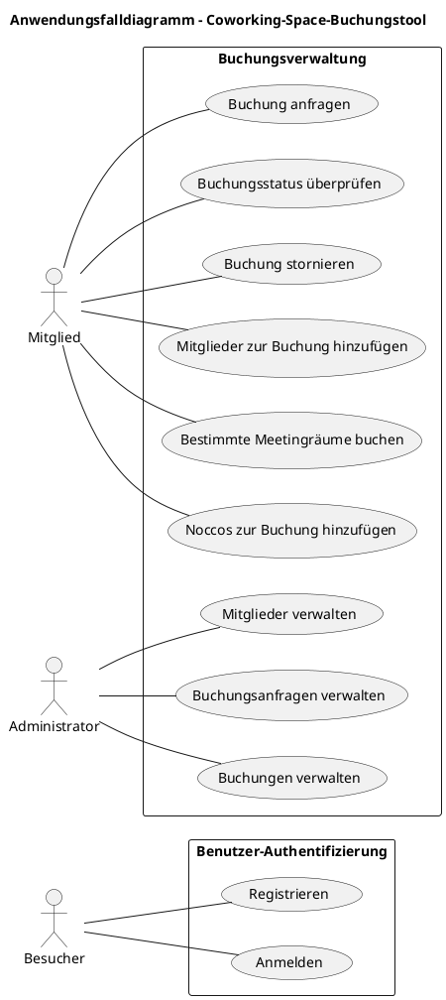

# Projektarbeit Uek M223 - Coworking-Space-Buchungsapplikation

## Setup

1. Git-Projekt klonen
2. Stelle sicher, dass Docker installiert ist und läuft.
3. Verzeichnis mit VS-Code öffnen
4. Dev-Container Extension installieren https://marketplace.visualstudio.com/items?itemName=ms-vscode-remote.remote-containers
5. Öffne das Projekt im Entwicklungscontainer.
6. Starte das Projekt mit dem Kommando `Quarkus: Debug current Quarkus Project`

### Web-Applikation

Die Applikation läuft auf der addresse und port: http://localhost:8080

Swagger API Interface läuft auf http://localhost:8080/q/swagger-ui/ 

### Datenbank

Die Daten werden in einer PostgreSQL-Datenbank gespeichert. In der Entwicklungsumgebung wird diese in der [docker-compose-yml](./.devcontainer/docker-compose.yml) konfiguriert.

### Datenbankadministration

Über http://localhost:5050 ist PgAdmin4 erreichbar. Damit lässt sich die Datenbank komfortabel verwalten. Der Benutzername lautet `zli@example.com` und das Passwort `zli*123`. Die Verbindung zur PostgreSQL-Datenbank muss zuerst mit folgenden Daten konfiguriert werden:
 - Host name/address: `db`
 - Port: `5432`
 - Maintenance database: `postgres`
 - Username: `postgres`
 - Password: `postgres`

### Testdaten

Testdaten sind unter `src/main/resources/import.sql`. Sie werden automatisch beim Start von Quarkus geladen.

### Test-Skript

Tests wurden statt mit Postman als Bash-Script mit Curls geschrieben.

Das test-file ist unter `src/main/resources/tests.sh` zu finden.

Mit `sh tests.sh` auf osx, `./tests.sh` auf linux und auf Windows bitte WSL verwenden und somit `./tests.sh`.

Das script loggt automatisch einen Admin und einen Member user an und speichert die Bearer tokens in bash-variablen. Diese werden dann für die einzelnen Tests / Requests verwendet.

## Ausgangslage
Ein Coworking Space in der Agglomeration von Zürich möchte in Zukunft seine Mitglieder und die Nutzung des Angebots digital über eine Webapplikation erfassen. Dazu sollte zuerst ein minimaler Prototyp realisiert werden, um den Kunden besser abholen zu können.
## Aufgabe
Die zu entwickelnde Prototyp soll aus einer Server- und Client-Applikation bestehen. Die Client-Applikation benutzt die Server-Applikation über eine HTTP API. Für den Prototyp sind folgende, menschliche Akteure vorgesehen:

- Administrator
- Mitglied
- Besucher (nicht authentifizierter Benutzer)

## Funktionale Anwendungsfälle

Folgende funktionalen Anwendungsfälle sollen mindestens im Prototypen implementiert werden:
- Als Besucher möchte ich mich mit meinem Vor- und Nachnamen, meiner E-Mail-Adresse und einem Passwort registrieren, damit ich die Rolle Mitglied bekommen kann.
- Als Besucher möchte ich mich mit meiner E-Mail-Adresse und meinem Passwort anmelden, damit ich mich als Mitglied oder Administrator authentifizieren kann.
- Als Mitglied möchte ich halbe und ganze Tage an bestimmten Daten im Coworking Space als Buchung anfragen, damit ich die Angebote des Coworking Space nutzen kann.
- Als Mitglied möchte ich den Status meiner Buchungen überprüfen, damit ich erfahre, ob meine Buchung bestätigt oder abgelehnt wurde.
- Als Mitglied kann ich meine zukünftigen Buchungen stornieren, damit ich auf Veränderungen in meiner Terminplanung reagieren kann.
- Als Administrator kann ich Mitglieder verwalten (erstellen, bearbeiten, löschen), damit ich die Mitglieder organisieren kann.
 - Als Administrator kann ich Buchungsanfragen akzeptieren und ablehnen, damit die Mitglieder das Angebot des Coworking Space nutzen können.
- Als Administrator kann ich Buchungen verwalten (erstellen, bearbeiten, löschen), damit ich die Buchungen organisieren kann.

## Nicht-funktionale Anwendungsfälle

Folgende nicht-funktionale Anforderungen sollen mindestens im Prototypen umgesetzt werden:
- Das Datenmodell erfüllt die erste, zweite und dritte Normalform nach der relationalen Entwurfstheorie.
- Der erste Besucher bekommt nach der Registrierung die Rolle Administrator anstatt Mitglied.
- Die Authentifizierung erfolgt mittels JSON Web Token (JWT nach RFC 7519) über den HTTP Header 'Authorization'.
- Das JWT läuft 24 Stunden nach der Ausstellung ab und verliert seine Gültigkeit.
- Das JWT wird clientseitig während dessen Lebensdauer persistent aufbewahrt.

## 1 - Anforderungen analysieren
Zusätzliche, projektrelevante Anforderungen wurden nach folgenden Kriterien beschrieben.

### 1.1 Erweiterte Anforderungen
#### A. Drei zusätzliche, einzigartige, funktionale Anforderungen sind als User Stories (Als [Akteur], kann ich [Funktion], damit [Kontext]) beschrieben.

- Als Mitglied, kann ich weitere Mitglieder zu einer Buchung hinzufügen, damit ein Coworking-Termin im Coworking-Space erstellt werden kann
- Als Mitglied, kann ich spezifische Meetingräume buchen, damit Meetings abgehalten werden können
- Als Mitglied, kann ich meiner Buchung Noccos (Energy-Drinks) hinzufügen, damit ich koffeinmässig fit bin für meine Arbeit 

#### B. Drei zusätzliche, einzigartige, nicht-funktionale Anforderungen sind messbar beschrieben.

- Passwörter werden gehasht abgelegt
- Der User muss nie länger als eine Sekunde auf das laden der Seite warten
- Die Web-Applikation hat 99 % Verfügbarkeit

#### C. Die zusätzlichen Anforderungen sind projektrelevant und auf die Bedürfnisse von einem Coworking Space abgestimmt.

#### Alle Funktionale Anwendungsfälle

Folgende funktionalen Anwendungsfälle sollen mindestens im Prototypen implementiert werden:
- Als Besucher möchte ich mich mit meinem Vor- und Nachnamen, meiner E-Mail-Adresse und einem Passwort registrieren, damit ich die Rolle Mitglied bekommen kann.
- Als Besucher möchte ich mich mit meiner E-Mail-Adresse und meinem Passwort anmelden, damit ich mich als Mitglied oder Administrator authentifizieren kann.
- Als Mitglied möchte ich halbe und ganze Tage an bestimmten Daten im Coworking Space als Buchung anfragen, damit ich die Angebote des Coworking Space nutzen kann.
- Als Mitglied möchte ich den Status meiner Buchungen überprüfen, damit ich erfahre, ob meine Buchung bestätigt oder abgelehnt wurde.
- Als Mitglied kann ich meine zukünftigen Buchungen stornieren, damit ich auf Veränderungen in meiner Terminplanung reagieren kann.
- Als Administrator kann ich Mitglieder verwalten (erstellen, bearbeiten, löschen), damit ich die Mitglieder organisieren kann.
 - Als Administrator kann ich Buchungsanfragen akzeptieren und ablehnen, damit die Mitglieder das Angebot des Coworking Space nutzen können.
- Als Administrator kann ich Buchungen verwalten (erstellen, bearbeiten, löschen), damit ich die Buchungen organisieren kann.
- Als Mitglied, kann ich weitere Mitglieder zu einer Buchung hinzufügen, damit ein Coworking-Termin im Coworking-Space erstellt werden kann
- Als Mitglied, kann ich spezifische Meetingräume buchen, damit Meetings abgehalten werden können
- Als Mitglied, kann ich meiner Buchung Noccos (Energy-Drinks) hinzufügen, damit ich koffeinmässig fit bin für meine Arbeit 

#### Alle nicht-funktionale Anwendungsfälle

Folgende nicht-funktionale Anforderungen sollen mindestens im Prototypen umgesetzt werden:
- Das Datenmodell erfüllt die erste, zweite und dritte Normalform nach der relationalen Entwurfstheorie.
- Der erste Besucher bekommt nach der Registrierung die Rolle Administrator anstatt Mitglied.
- Die Authentifizierung erfolgt mittels JSON Web Token (JWT nach RFC 7519) über den HTTP Header 'Authorization'.
- Das JWT läuft 24 Stunden nach der Ausstellung ab und verliert seine Gültigkeit.
- Das JWT wird clientseitig während dessen Lebensdauer persistent aufbewahrt.
- Passwörter werden gehasht abgelegt
- Der User muss nie länger als eine Sekunde auf das laden der Seite warten
- Die Web-Applikation hat 99 % Verfügbarkeit

### 1.2 - Persona

Personas wurden für die im Projekt vorhandenen Akteure nach folgenden Kriterien beschrieben.
#### Anforderungen

- A. Für jeden Akteur wird eine Persona beschrieben.
- B. Jede Persona ist mit Vor- und Nachnamen, Alter und Geschlecht beschrieben.
- C. Jede Persona ist mit einem passenden Bild beschrieben.
- D. Zu jeder Persona ist ihre berufliche Tätigkeit beschrieben.
- E. Zu jeder Persona ist beschrieben, aus welchen Gründen die Angebote von einem Coworking Space benutzt werden.

#### Personas

##### Persona 1 - Nicht angemeldeter User

- **Name:** Richie Rich
- **Alter:** 10
- **Geschlecht:** Männlich
- **Rolle:** Nicht angemeldeter User
- **Beruf:** Richie ist ein reiches Schulkind.
- **Gründe für Besuch von Coworking Space:**  Richie wird das Rich-Imperium von seinem Vater Richard Rich Sr. übernehmen und möchte sich für den Coworking Space anmelden um dort seine erste Meetings abhalten zu können.
##### Persona 2 - Angemeldeter User

- **Name:** Patrick Bateman
- **Alter:** 27
- **Geschlecht:** Männlich
- **Rolle:** User
- **Beruf:** Bateman ist **Börsenmakler bei Pierce & Pierce**, arbeitet aber eigentlich kaum.
- **Gründe für Besuch von Coworking Space:** Patrick Bateman möchte gerne einen Ort haben wo er potentielle Kunden und Geschäftspartner treffen kann. Bateman möchte auch einen Ort haben an dem er in aller Ruhe mit seinen Arbeitskollegen Visitenkarten vergleichen kann.

##### Persona 3 - Administrator

- **Name:** Elon Musk
- **Alter:** 52
- **Geschlecht:** Männlich
- **Rolle:** Administrator
- **Beruf:** Elon Musk war ein Multi-Milliardär und Unternehmer, der aber mit dem Kauf von Twitter die Firma und sich selber in den Ruin trieb.
- **Gründe für Besuch von Coworking Space:** Elon Musk möchte gerne eine neue Firma starten und hat sich daher dafür entschieden in der Zürcher Agglomeration einen Coworking-Space zu bauen. Mit seiner Erfahrung von Twitter / X möchte er als Administrator den reibungslosen Betrieb der Buchungsplatform garantieren.

### 1.3 - Anwendungsfalldiagramm

Ein Anwendungsfalldiagramm wurde nach UML 2 und folgenden Kriterien erstellt.
#### Anforderungen

- A. Der Systemkontext und ein projektrelevanter Systemtitel ist abgebildet.
- B. Alle Akteure und deren Namen sind visualisiert.
- C. Alle funktionalen Anforderungen (inkl. der zusätzlichen Anforderungen aus Kriterium 1) sind als Anwendungsfälle abgebildet.
- D. Die Relationen zwischen Akteuren und Anforderungen sind visualisiert.

#### Diagramm - PlantUML code

