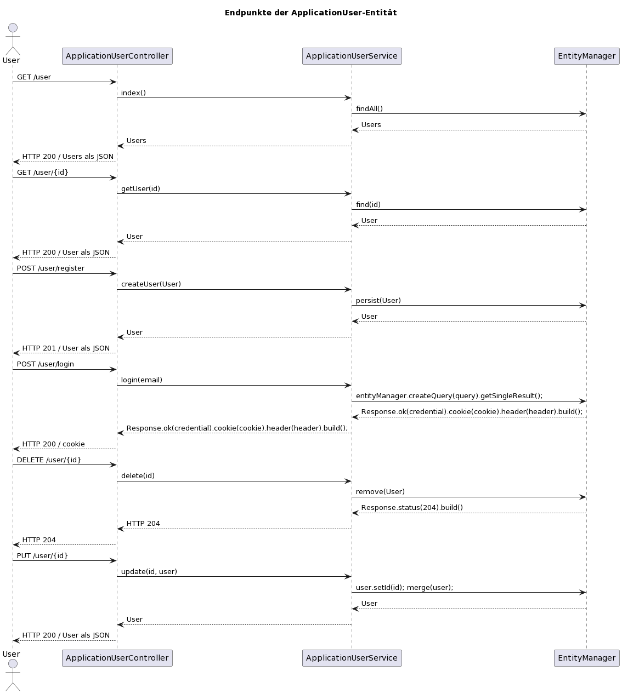
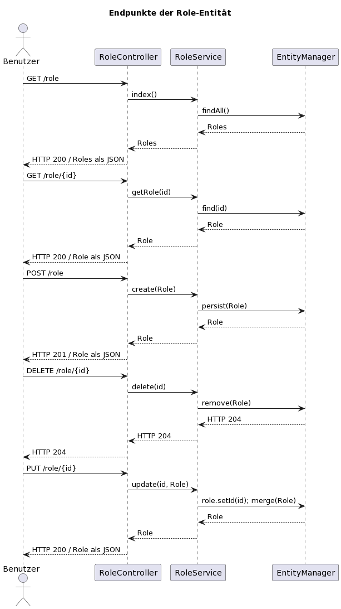
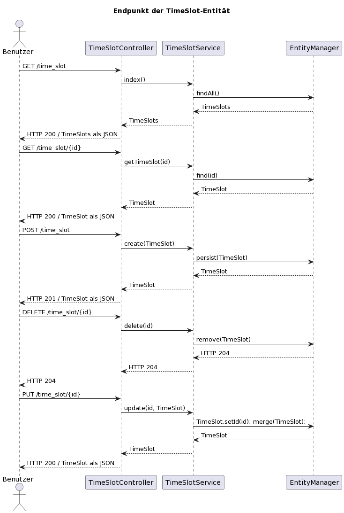

## 3 - Schnittstelle planen

### 3.1 Schnittstellenplanung

Die Schnittstellenplanung beschreibt die Endpunkte um die oberhalb beschriebenen Anforderungen nach folgenden
#### Anforderungen

- A. Die Pfade der Endpunkte sind nach dem REST Paradigma aufgebaut.
- B. Mögliche Parameter (bspw. Ressourcen ID) im Aufrufpfad sind beschrieben.
- C. Die HTTP-Verben sind nach dem REST Paradigma gewählt.
- D. Sowohl für Erfolgs- als auch Fehlerfälle sind die Rückmeldungen der Endpunkte mit HTTP Status beschrieben, sowie wenn diese auftreten.

#### Schnittstellen

##### ApplicationUser

**Path:** `/user`

- index GET
	-  Path: `/user`
- show GET
	- Path: `/user/{id}`
- register POST
	- Path: `/user/register`
- login POST
	- Path: `/user/login`
- delete DELETE
	- Path: `/user/{id}`
- update 
	- PUT
		- Path: `/user/{id}`

##### Role

**Path:** `/role`

- index GET
	-  Path: `/role`
- show GET
	- Path: `/role/{id}`
- create POST
	- Path: `/role`
- delete DELETE
	- Path: `/role/{id}`
- update 
	- PUT
		- Path: `/role/{id}`

##### Booking

**Path:** `/booking`

- index GET
	-  Path: `/booking`
- show GET
	- Path: `/booking/{id}`
- create POST
	- Path: `/booking`
- accept POST
	- Path: `/booking/{id}/accept`
- decline POST
	- Path: `/booking/{id}/decline`
- cancel POST
	- Path: `/booking/{id}/cancel`
- delete DELETE
	- Path: `/booking/{id}`
- update 
	- PUT
		- Path: `/booking/{id}`

##### MeetingRoom

**Path:** `/meeting_room`

- index GET
	-  Path: `/meeting_room`
- show GET
	- Path: `/meeting_room/{id}`
- create POST
	- Path: `/meeting_room
- delete DELETE
	- Path: `/meeting_room/{id}`
- update 
	- PUT
		- Path: `/meeting_room/{id}`

##### TimeSlot

**Path:** `/time_slot`

- index GET
	-  Path: `/time_slot`
- show GET
	- Path: `/time_slot/{id}`
- create POST
	- Path: `/time_slot`
- delete DELETE
	- Path: `/time_slot/{id}`
- update 
	- PUT
		- Path: `/time_slot/{id}`

##### Noccos

**Path:** `/nocco`

- index GET
	-  Path: `/nocco`
- show GET
	- Path: `/nocco/{id}`
- create POST
	- Path: `/nocco`
- delete DELETE
	- Path: `/nocco/{id}`
- update 
	- PUT
		- Path: `/nocco/{id}`

### 3.2 Sequenzdiagramm

#### Anforderungen

#### Sequenzdiagramm

##### ApplicationUser-Entität

###### PlantUML code

###### Bild des Sequenzdiagramms

##### Role-Entität

###### PlantUML code

###### Bild des Sequenzdiagramms

##### Booking

###### PlantUML code

###### Bild des Sequenzdiagramms

##### MeetingRoom-Entität

###### PlantUML code

###### Bild des Sequenzdiagramms

##### TimeSlot

###### PlantUML code

###### Bild des Sequenzdiagramms

##### Nocco-Entität
###### PlantUML code

###### Bild des Sequenzdiagramms

